# slay-my-stats

Yet another Slay the Spire 2 analysis solution, built from the `.run` files the game saves, but this time it's
focused on you and your progression, not social stats. It works two ways, from the same parser and the same
dashboard code:

- **Locally:** `run.py` reads your history folder and writes one HTML file.
- **Online at [slay-my-stats.com](https://slay-my-stats.com):** you sign in with Steam and upload your history
  folder from the browser. Your profile lives at `/u/<name>`, named after your Steam name, and anyone can find
  it by searching on the home page.

**Overview:** totals, then a card for each character with its records and most-picked cards.

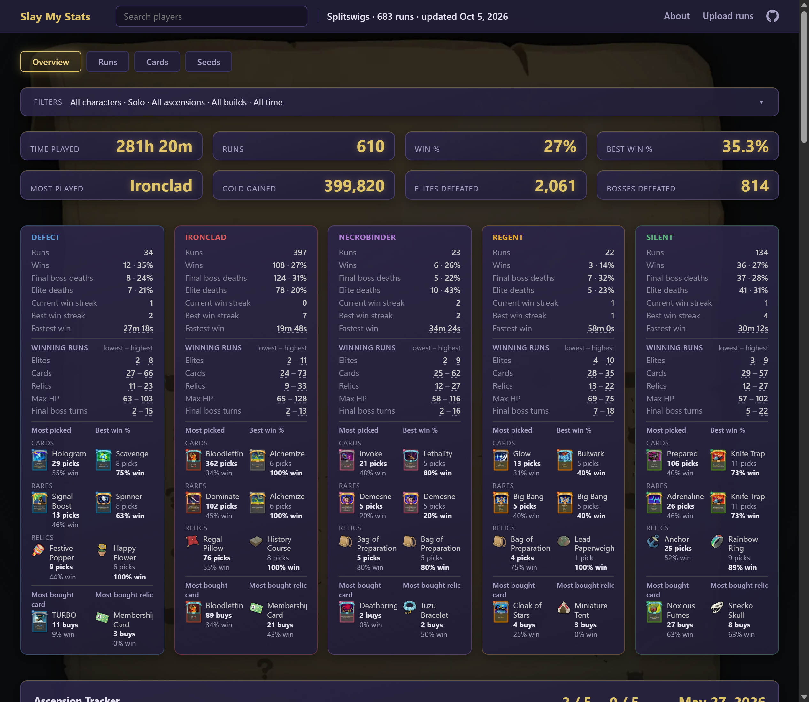

**Run Detail:** every run in a list; pick one to see its path, fights and final deck, including any
enchantment a card is carrying.

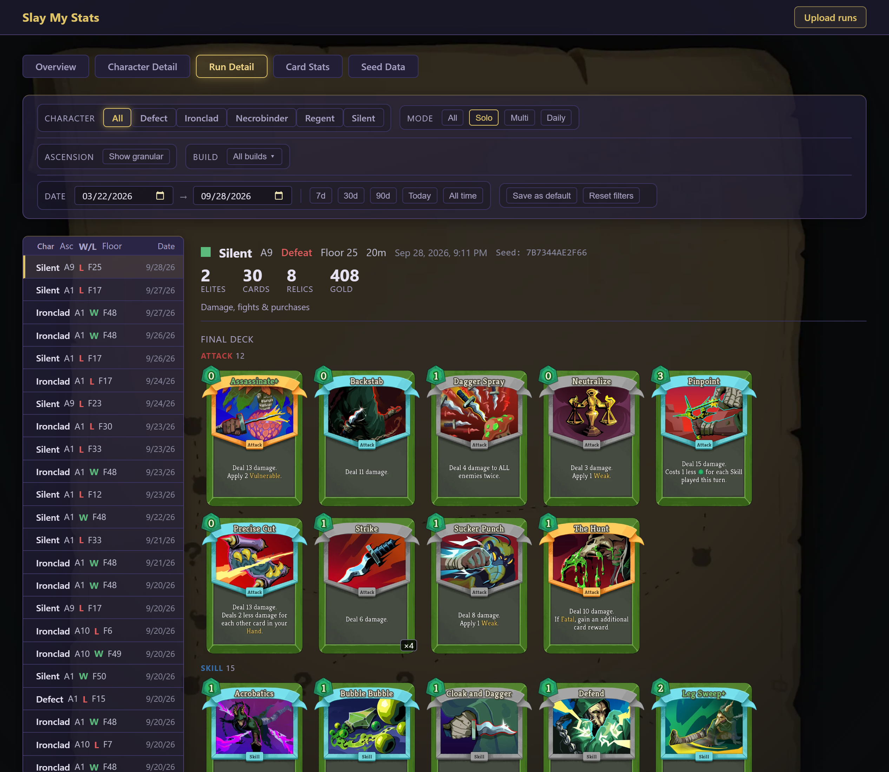

**Character Detail:** win rates against each boss and elite.

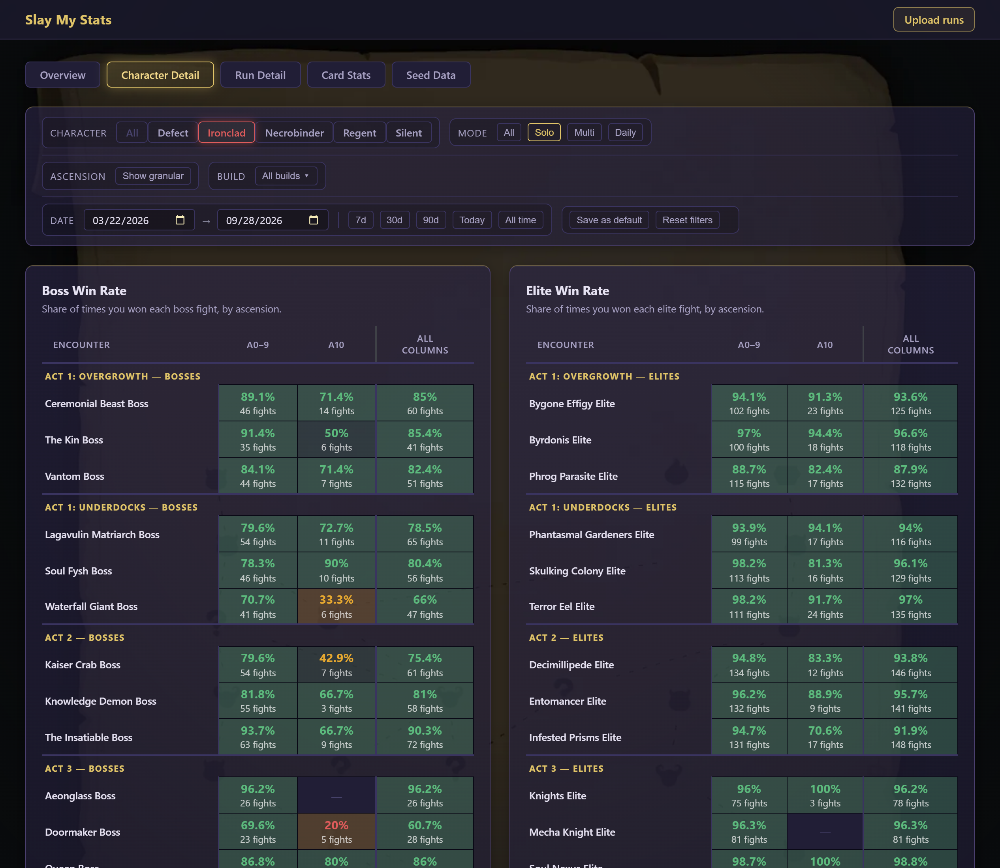

**Card Stats:** pick and win rates for every card.

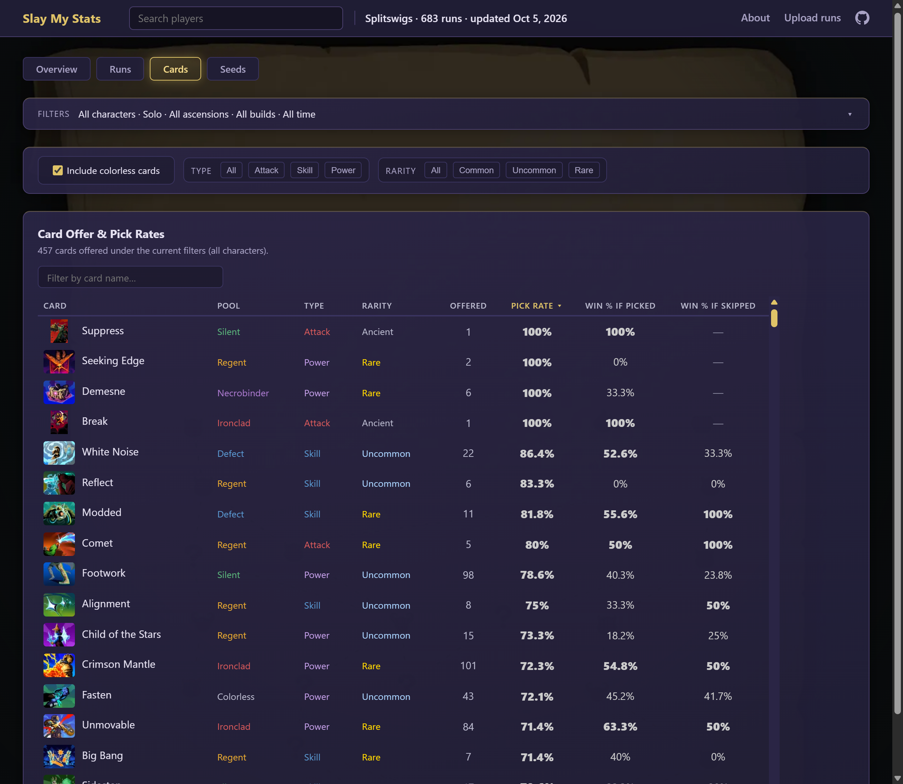

The dashboard has five pages: Overview, Character Detail, Run Detail, Card Stats and Seed Data. They cover win
rates by character, ascension and build, boss and elite results, card and relic picks, per-floor HP and damage,
and seed lookup.

**Contents:** [Repository layout](#repository-layout) ·
[How it fits together](#how-it-fits-together) ·
[Local use](#local-use) ·
[The website](#the-website) ·
[Development](#development) ·
[Refreshing game data](#refreshing-game-data)

## Repository layout

```text
slay-my-stats/
├── run.py                   Reads .run files into dashboard data and writes the local HTML file. The upload Lambda uses the same parsing code.
├── build_site.py            Builds dist/ for the site: index.html, app.js, catalog.json, site-config.json
├── dashboard.css            Dashboard styles (shared by the local file and the site)
├── js/                      Dashboard code, one module per page or concern (shared)
│   ├── data.js              window.DATA shape and helpers
│   ├── aggregation.js       filtering and stat roll-ups
│   ├── page-nav.js          tabs and the shared filter bar
│   ├── overview-tables.js   Overview page
│   ├── character-detail.js  Character Detail page
│   ├── run-detail.js        Run Detail page
│   ├── cards-page.js        Card Stats page
│   ├── seeds.js             Seed Data page
│   ├── charts.js            Chart.js setup
│   ├── card-face.js         card rendering
│   ├── render-helpers.js    shared markup builders
│   ├── tooltip.js           floating tooltips
│   ├── update.js            re-render on filter change
│   └── map-bg.js            background map panning
├── site/                    Site-only code (not in the local file)
│   ├── boot.js              router: player finder + site stats on /, profiles on /u/<slug>, pages
│   ├── pages/               hand-written pages: <name>.html is served at /<name> (see its README)
│   ├── home-intro.html      the home page's intro, above the player search
│   ├── players.css          site bar, finder, site stats, pages
│   ├── upload.js            Steam sign-in and the upload panel
│   └── upload.css
├── infra/                   CDK app
│   ├── app.py
│   ├── slay_my_stats/slay_my_stats_stack.py   every AWS resource (see "AWS resources")
│   ├── lambda/ingest/handler.py               the upload Lambdas (ingest, process, failure)
│   ├── tests/test_ingest.py
│   └── requirements.txt     CDK, boto3
├── tools/
│   ├── serve_site.py        local dev server emulating CloudFront + the Lambda
│   ├── deploy.py            pre-push deploy (see "Deploying")
│   ├── build_user_blob.py   local history -> local_data/, as an upload would
│   ├── rebuild_profiles.py  re-parse kept uploads into profiles (after a parser fix)
│   ├── rebuild_stats.py     recount users/_stats.json.gz from every profile
│   ├── remove_profile.py    take a profile off the site
│   ├── refresh_game_data.py game-data pipeline driver (see "Refreshing game data")
│   ├── export_game_data.py  drives the game to export its data and render every card face
│   ├── import_game_data.py  folds that export into the site's data files
│   ├── extract_card_data.py, downscale_*.py, bake_*.py   its steps
│   └── requirements.txt     pipeline requirements
├── githooks/pre-push        runs tools/deploy.py when main or gamma is pushed
├── docs/                    architecture diagram source (draw.io)
└── images/                  README screenshots and the architecture diagram
```

Generated and ignored: `dist/` (site build), `local_data/` (dev server data), `infra/cdk.out/`, and the
full-resolution `pck_recover*/` game extractions.

**Not in the repo:** the game's art and data. They're Mega Crit's, so they aren't redistributed here;
[Refreshing game data](#refreshing-game-data) builds them from your own copy of the game into these ignored
paths:

```text
├── card_data.json           card metadata, as the game reports it
├── relic_data.json          relic metadata
├── potion_data.json         potion metadata
├── card_variants.json       what a card's saved per-instance state makes it (e.g. Mad Science's roll)
├── enchantments_data.json   enchantment titles and per-amount text
├── data_provenance.json     which game build produced the data and art
├── card_final/              finished card images, base and upgraded (served)
├── card_portraits/          card art thumbnails (served)
├── enchantment_images/      enchantment icons (served)
├── thumbs/                  icon-size copies of the art (served)
├── relic_images/            (served)
├── potion_images/           (served)
├── node_icons/              map node icons (served)
├── ui_icons/                energy icons, map_scroll.webp background (served)
└── card_chrome/             card frames and banners (input to the superseded bake_finished_cards.py; not served)
```

## How it fits together

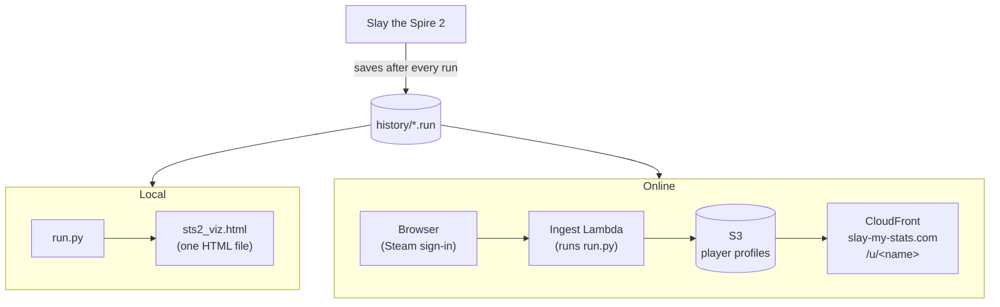

The parser (`run.py`) and the dashboard (`js/`, `dashboard.css`) are shared by both paths, so the local file and
the site always show the same numbers.

**Locally,** `run.py` parses your history and writes one HTML file with your runs, the dashboard code and the
styles inlined. The game art stays in the repo and the page links to it.

**The site is static.** Every page is the same `index.html` and `app.js`, stored in S3 and served by CloudFront
from its edge locations worldwide. No server builds pages: visiting `/u/<name>` loads that player's runs (a small summary,
`users/<slug>.json.gz`, then a file per month of runs), and the dashboard code computes every stat in the browser, exactly as it does in the
local file.

**Uploads appear on the next page load.** The browser sends new runs straight to S3, and a Lambda parses them with
`run.py` and writes them into the player's month files; there's no build step. Profile files are never cached by
CloudFront, and the browser checks for a newer copy on every visit, so a new upload shows up right away. If nothing changed, that check returns a few
hundred bytes.

**The home page** reads two small files the Lambda also updates on each upload: the player list for search, and
the site-wide running totals (see [Site-wide stats](#site-wide-stats)).

**Server-side code** is just the upload Lambdas (one checks the Steam sign-in and hands out an upload URL, one
adds each upload to its profile), plus the budget kill switch. Viewing a page runs no Lambda at all;
the only code involved is a small CloudFront Function that sends every `/u/<name>` address to `index.html`.

## Local use

Needs Python 3.10+ and no packages, plus the game art and data, which aren't in the repo: build them first
with [Refreshing game data](#refreshing-game-data).

```sh
python run.py                           # finds your save folder, writes ~/sts2_viz.html, opens it
python run.py --history "<path>"        # a specific history folder
python run.py --out stats.html --no-open
```

The history folder is usually here:

| OS      | Path |
|---------|------|
| Windows | `%APPDATA%\SlayTheSpire2\steam\<SteamID64>\profile1\saves\history` |
| macOS   | `~/Library/Application Support/SlayTheSpire2/steam/<SteamID64>/profile1/saves/history` |

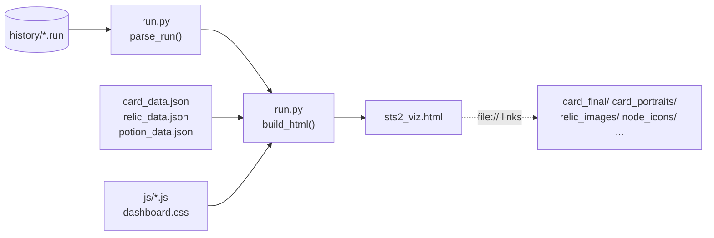

## The website

The site is static: an S3 bucket behind CloudFront. The only server-side code is the Lambdas that handle
uploads. For each player they store gzip'd JSON, a summary with their Steam name and their parsed runs a month per
file, which the browser downloads and renders. There are no accounts, sessions, cookies or database.

### Architecture

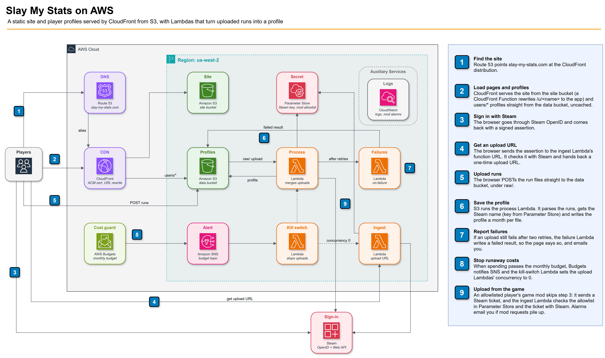

The diagram's source is [docs/slay-my-stats-architecture.drawio](docs/slay-my-stats-architecture.drawio); open it in
[draw.io](https://app.diagrams.net/) to edit, then re-export the PNG.

### AWS resources

Everything is one CDK stack, `SlayMyStatsStack` (`infra/slay_my_stats/slay_my_stats_stack.py`), deployed to
the CLI's default account and region (us-west-2 today).

| Resource | Configuration | Why |
|----------|---------------|-----|
| **Site bucket** `slay-my-stats-site` | Private (CloudFront OAC only). Destroyed with the stack. | The built `dist/` plus game art. Rebuildable from the repo at any time. |
| **Data bucket** `slay-my-stats-data` | Private (CloudFront OAC for `users/*` only). **Retained** if the stack is deleted. CORS for `https://slay-my-stats.com` POSTs, since uploads go straight here. Upload results expire after 7 days. | Players' uploads live only here. Standing the stack up again needs the old bucket imported, or emptied and deleted by hand, first. |
| **CloudFront distribution** | `slay-my-stats.com`, HTTP redirects to HTTPS, default root `index.html`. Behaviors below. | One domain for the site and the profile data, so the browser needs no CORS for reads. |
| **CloudFront Function** (`ProfileUrlRewriteFunction`) | Viewer request, JS 2.0. Sets the URI to `/index.html`. | Page URLs like `/u/<slug>` have no S3 object. Rewriting at the edge keeps the shareable URL in the address bar. Attached only to page behaviors, so asset requests never pay for it. |
| **Route 53 A record** | Alias to the distribution, in an existing hosted zone. | The domain. The hosted zone is created outside CDK. |
| **ACM certificate** | Imported by ARN, us-east-1. | CloudFront only reads certificates from us-east-1. Created outside CDK. |
| **Ingest Lambda** | Python 3.12, 256 MB, 15 s timeout, one-week log retention. Public Function URL, CORS for `https://slay-my-stats.com` POSTs only. | Checks the Steam sign-in and the rate limits, then hands out a presigned POST for one upload. It verifies the sign-in itself, so no API Gateway, and never sees the upload, so it stays small. |
| **Process Lambda** | Python 3.12, 1024 MB, 5 min timeout, one-week log retention. Invoked by S3 for each new `raw/` object, retried twice. | Parses an upload and merges it into the profile a month at a time, so it costs the same however big the profile is. A 20,000-run upload took ~50 s locally; only one that big runs long. |
| **Failure Lambda** | Python 3.12, 128 MB, 15 s timeout, one-month log retention. The process Lambda's on-failure destination; can only write `users/_uploads/*` and publish to the alert SNS topic, which has one email subscription. | When an upload has failed every retry, writes a failed result so the uploader's page says so instead of waiting, logs it, and emails you the raw key and the error. Lambda calls it directly, with no queue to poll, so it costs nothing unless something fails (SNS's first 1,000 emails a month are free). |
| **SSM parameter** `/slay-my-stats/steam-api-key` | SecureString, imported by name; the process Lambda gets read and `kms:Decrypt`. | Steam Web API key for display names. CloudFormation can't create a SecureString with a real value, so it's created with the AWS CLI. |
| **Budget** `slay-my-stats-kill-switch` | A small monthly limit on actual cost, filtered to Lambda, CloudWatch and S3. Notifies SNS. | All of these stay inside the free tier at normal traffic, so spend past the limit means abuse. Route 53's fixed zone fee is left out so it can't trip it. |
| **SNS topic + kill-switch Lambda** | Python 3.12, 128 MB. Only permission: `lambda:PutFunctionConcurrency` on the ingest and process functions. | Sets their reserved concurrency to 0. Budgets evaluate a few times a day, so this bounds a sustained attack rather than stopping it instantly. Undo with `aws lambda delete-function-concurrency`. |

Stack outputs: `SiteBucketName`, `DataBucketName`, `DistributionDomainName` and `IngestFunctionUrl` (which
`tools/deploy.py` reads when building the site).

### Routing

| Path | CloudFront behavior | Origin | Caching |
|------|---------------------|--------|---------|
| `/u/*` | rewrite to `/index.html` | site bucket | optimized (`/index.html`'s cache entry) |
| `/<page>`, `/<page>/` (one pair per `site/pages/` file) | rewrite to `/index.html` | site bucket | optimized |
| `/users/*` | none | data bucket | **disabled**, so a profile shows an upload straight away |
| everything else (`/`, `/app.js`, `/catalog.json`, art) | none | site bucket | optimized |

`ids/*` in the data bucket has no behavior, so it's unreachable from outside.

Inside the page, `site/boot.js` decides what to draw from `location.pathname`: the player finder and
site-wide stats on `/`, a hand-written page on `/<page>` (fetched from `/page-<page>.html`), or a
profile on `/u/<slug>`, which it loads by fetching `/catalog.json`, the profile summary
`/users/<slug>.json.gz` and then all its month files at once, joining them into `window.DATA` and then loading
`/app.js`.

### Stored data

| Key | Served | Contents |
|-----|--------|----------|
| `users/<slug>.json.gz` | yes | profile summary: `{"v":2, "name", "parser", "months": {"YYYY-MM": [start times]}, "noRaw"}` |
| `users/<slug>/<YYYY-MM>.json.gz` | yes | that month's parsed runs: `{"v":2, "runs"}` |
| `users/_index.json.gz` | yes | every player's slug, name, run count and last upload, for the home page's search |
| `users/_stats.json.gz` | yes | site-wide running totals for the home page (see below) |
| `users/_uploads/<id>.json.gz` | yes | one upload's result (counts, or why it failed), which the page that sent it polls. The id is random; expires after 7 days. |
| `ids/<steamid>.json.gz` | no | `{"slug"}`, so an upload finds its profile |
| `raw/<steamid>/<time>-<id>.ndjson.gz` | no | every upload exactly as sent, so profiles can be rebuilt after a parser fix |
| `limits/` | no | when upload URLs were last handed out, per Steam account and per IP address |

A profile is split by month so an upload only reads and writes the months it adds to, and costs the same however
big the profile gets. The page fetches every month and joins them, so it still reads as one history. `noRaw`
lists runs uploaded before raw uploads were kept; the page sends those again so they get a raw copy.

Steam IDs are never public. The Lambda gets the display name from Steam's `GetPlayerSummaries` API using the
key in SSM, and falls back to the public profile XML if the API call fails.

### Player addresses

A profile's address is its Steam name reduced to lowercase `a-z0-9`: "Mr. Bean!" becomes `/u/mrbean`. The
address is set on the first upload and never changes. A later player with the same name gets `mrbean-2`, then
`mrbean-3`, and so on. A name with nothing usable left, such as one written entirely in Japanese, becomes
`player`, `player-2`, and so on. Renaming on Steam updates the name shown on the profile, not the address.

### What an upload does

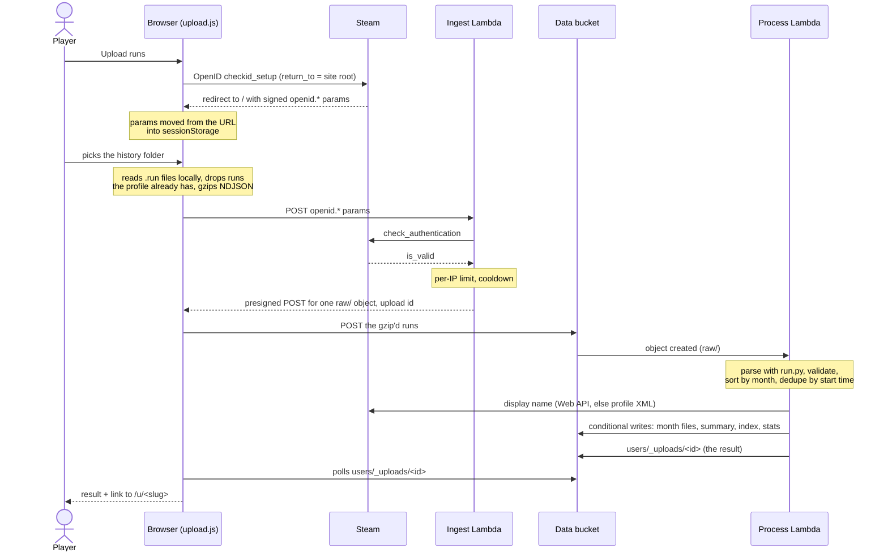

1. **Sign in.** "Upload runs" in the site bar sends you to Steam's OpenID login. Steam redirects back to the
   site with signed `openid.*` parameters, which prove your Steam ID. Every upload carries that proof, and the
   ingest Lambda re-checks it with Steam. The same sign-in works for more uploads until it's 30 minutes old.
2. **Pick the folder.** The browser reads the `.run` files locally and drops runs your profile already has. It
   knows your profile from an earlier upload in this browser, or else from the ingest Lambda's answer. It gzips
   the rest as NDJSON (one run per line).
3. **Get an upload URL.** The ingest Lambda checks the per-IP limit, verifies the sign-in (Steam confirms the
   signature, `return_to` is this site, and it's under 30 minutes old) and enforces a 60-second cooldown per
   Steam account. It answers with a presigned POST, good for 10 minutes, for one new `raw/` object of up to
   100 MB, plus the upload's id. It never sees your runs.
4. **Send.** The browser POSTs the file straight to S3.
5. **Process.** S3 invokes the process Lambda, which:
   - stream-decompresses the upload and parses each run with the same `run.py` the local tool uses;
   - rejects any run containing a string outside `[A-Za-z0-9_.-]`, because profiles are rendered in other
     people's browsers;
   - sorts the runs by month on local disk, then merges each month into its file by start time with a
     conditional S3 write, so two simultaneous uploads can't lose each other's runs. Only the months the upload
     touches are read or written;
   - looks up your current Steam name; on a first upload, it claims your address with a must-not-exist write,
     so two new players with the same name can't both get it;
   - writes the profile summary, updates the home page's player list, and adds the new runs, and only those,
     to the site-wide stats;
   - writes the upload's result.

   An upload with no runs in it at all is deleted. Every other upload is kept, so profiles can be rebuilt after
   a parser fix.
6. **Result.** The page polls for the result and shows the counts and a link to your profile. If processing
   fails, Lambda retries it twice; after that the failure Lambda writes a failed result, so the page says so.
   The browser remembers your address for next time.

Upload limits, from the top of `handler.py`:

| Limit | Value |
|-------|-------|
| Sign-in age | 30 minutes (±5 minutes clock skew) |
| Upload URLs | 5 per IP address (per /64 for IPv6) per hour, and 60 seconds apart per Steam account |
| Upload URL lifetime | 10 minutes |
| Upload size | 100 MB gzip'd (~35,000 runs) |
| Decompressed upload | 2 GB, 4 MB per line |
| Runs / months per upload | 20,000 / 240 |
| Runs per profile | no cap (stored a month at a time) |
| Parsed run size | 1 MB |
| Strings in a run | `[A-Za-z0-9_.-]`, up to 80 characters |

### Site-wide stats

The home page shows stats across every player's runs, solo and multiplayer side by side (solo leaves out
daily runs, matching the dashboard's Solo filter): win rate for each and by character; the uncommon and
rarer cards and the relics with the best win rates (at least 10 runs each); the fights that end the most
runs; and the fastest solo win.

Every figure is a running total: `[runs, wins]` pairs, counts, minutes, and best-so-far records. The process
Lambda tallies just the runs an upload added and adds that onto `users/_stats.json.gz` with a conditional
write. No one's history is ever reread, and a duplicate run is never counted twice. The file holds raw
counts for every card and relic, around 11 KB for 660 runs, so the page does the ranking and its thresholds
can change without recounting.

The update is best effort, like the player list. `tools/rebuild_stats.py` recounts everything from the
profiles: run it by hand after adding a new figure, removing or rebuilding a profile, or if an update was
missed.

### Maintenance tools

These work on `local_data/` (the dev server's store), or on the live bucket with `--bucket slay-my-stats-data`
(needs AWS credentials). Each has `--dry-run`.

- `tools/rebuild_profiles.py` re-parses players' kept uploads after a fix to `run.py`'s parser. Bump
  `run.PARSER_VERSION` with the fix, then `--stale` rebuilds the profiles an older parser built.
- `tools/remove_profile.py --slug <slug>` takes a profile off the site. The player's next upload starts a fresh
  one. Add `--raw` to delete their kept uploads too.
- `tools/rebuild_stats.py` recounts the site-wide stats. Run it after either of the above.

## Development

```sh
python -m venv infra/.venv
infra\.venv\Scripts\pip install -r infra/requirements.txt      # CDK and boto3 (infra, deploy, live stats recount)

infra\.venv\Scripts\python.exe build_site.py                   # builds dist/
infra\.venv\Scripts\python.exe tools/build_user_blob.py        # your runs -> local_data/ (optional)
infra\.venv\Scripts\python.exe tools/serve_site.py --port 8123 # http://127.0.0.1:8123/
```

`tools/serve_site.py` emulates the CloudFront routing. It also stands in for the upload path, running the real
Lambda code against `local_data/` (the same layout as the bucket): `POST /api/ingest` is the ingest Lambda, and the
upload URL it hands out is the server's own `/api/raw-upload`, which stores the file under `local_data/raw/` and
processes it on the spot, in place of S3 and its event. So the upload flow, including a real Steam sign-in, works
locally. Locally the Steam name comes from the public profile XML, unless
you set `STEAM_API_KEY`.

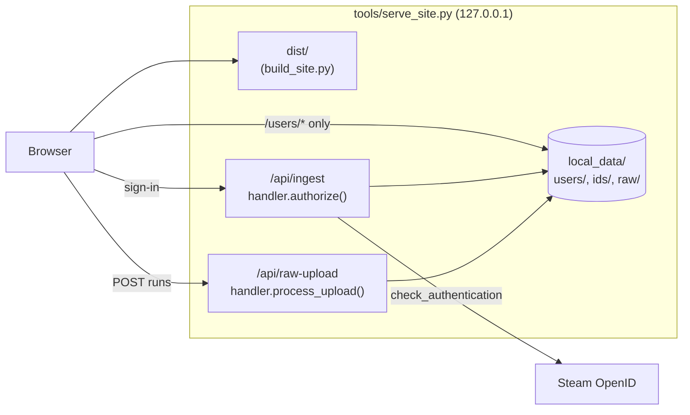

Ingest tests:

```sh
infra\.venv\Scripts\python.exe -m unittest discover infra/tests
```

These tests stub Steam and S3. They include a round trip of your real local history, if you have one, which
must match `run.py`'s output exactly.

### Deploying

`git config core.hooksPath githooks` (once per clone) makes every push of `main` run `tools/deploy.py`, and
every push of `gamma` run it for [gamma](#gamma):

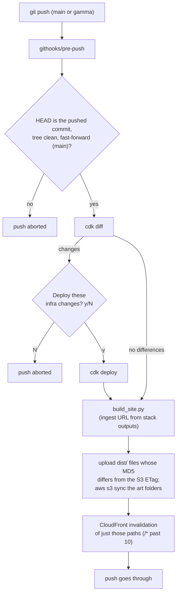

Any change to `run.py` or the handler shows up in `cdk diff` as new code for the Lambdas, since they bundle
both. To skip deploying for one push, use `SKIP_DEPLOY=1 git push`.

Set up once, outside CDK:

- the Route 53 hosted zone and the ACM certificate in us-east-1, with their IDs in `infra/cdk.context.json`
  (ignored by git), next to the address failed uploads are emailed to:
  `{"certificateArn": "arn:aws:acm:us-east-1:…", "hostedZoneId": "Z…", "alertEmail": "you@example.com"}`.
  After the first deploy with it, click the confirmation link AWS emails there;
- the Steam Web API key: `aws ssm put-parameter --name /slay-my-stats/steam-api-key --type SecureString`;
- `cdk bootstrap` for the account and region.

### Gamma

`tools/deploy.py --stage gamma` deploys the same checkout to gamma.slay-my-stats.com: a second copy of the
stack, with its own buckets and upload function, for checking a change against real CloudFront before
production gets it. Pushing the `gamma` branch runs the same thing (`git push origin gamma`, or
`git push --force origin HEAD:gamma` from whichever branch you want there); pushing `main` always deploys
production. It needs its own
certificate (for `gamma.slay-my-stats.com`, in us-east-1) and the hosted zone that subdomain is delegated to,
as `"gammaCertificateArn"` and `"gammaHostedZoneId"` in `infra/cdk.context.json`. Without those two the gamma
stack isn't built at all.

Gamma isn't public. It answers only the addresses listed as `"gammaAllowedIps"` in `infra/cdk.context.json`
(e.g. `["203.0.113.7"]`) and returns 403 to everyone else, pages and uploads both. If your address changes,
update the list and deploy gamma again.

## Refreshing game data

After a game update, run `python tools/refresh_game_data.py`. Its requirements are in
`tools/requirements.txt`. `--check` verifies without changing anything, and `--stale` reports whether the
installed game is newer than the committed assets.

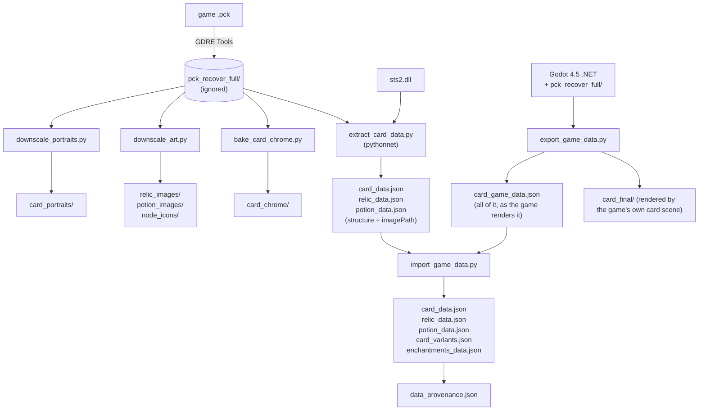

It recovers the game's `.pck` with [GDRE Tools](https://github.com/GDRETools/gdsdecomp/releases), then
re-extracts card, relic and potion data from the game DLL. Next it re-bakes card art and chrome, and checks
that everything came from the same build. The map background (`ui_icons/map_scroll.webp`) is baked
separately by `tools/bake_map_background.py`.

Text and images are not re-derived, though — that was measurably wrong. Earlier versions re-implemented the
game's text grammar and composited each card in Pillow, which read Tank's 1.5x damage multiplier as an int
(its card said "Take 0% more damage" where the game says 50%) and dropped grammar the game supports.
`tools/export_game_data.py` asks the game instead: it builds and runs the exporter in `pck_recover_full/`
(`tools/ExportCards.cs`, an autoload that is inert unless `EXPORT_CARDS=1`), which formats every description
with the game's own formatters and renders each card through the game's own card scene, then
`tools/import_game_data.py` folds the result into the data files above. It needs the **Godot 4.5 .NET** editor
(the non-.NET build cannot run the game's C#) and refuses to copy an export that this run didn't write.
`tools/bake_finished_cards.py` and the hand-ported grammar are kept only as a fallback.

## Contributing

Issues, bug reports and ideas are welcome, so open one! PRs I'll take case by case... this is a passion project
and I'd like to keep steering it, so for anything bigger than a fix, open an issue first so we can talk it over.

## License

Copyright (C) 2026 Jesse Johnston.

The code is licensed under the [MIT License](LICENSE): you can use, change and share it, including
commercially, as long as you keep the copyright notice and license text.

The license covers the code only. The game's art, card data and other assets the site shows are Mega Crit's,
from Slay the Spire 2, and aren't included in this repository. This is a fan project, not affiliated with or endorsed by Mega Crit.
