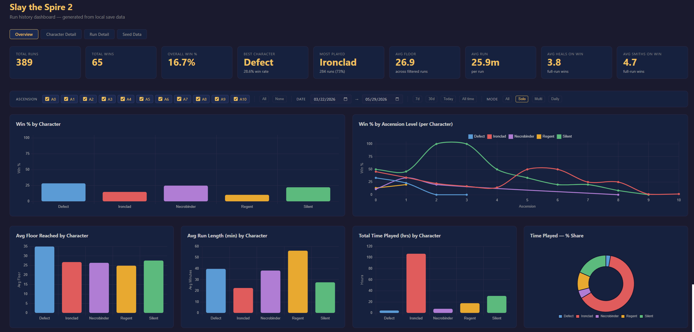
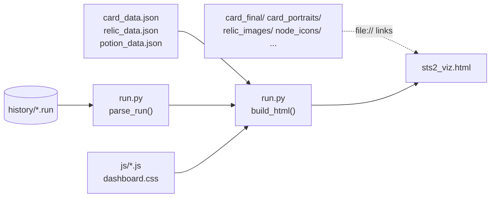
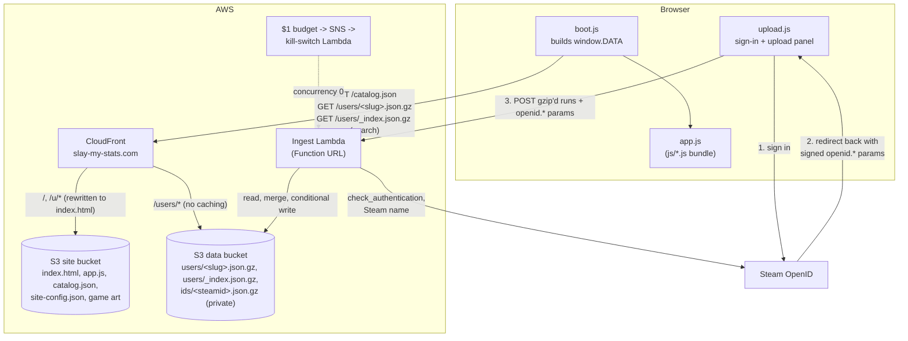
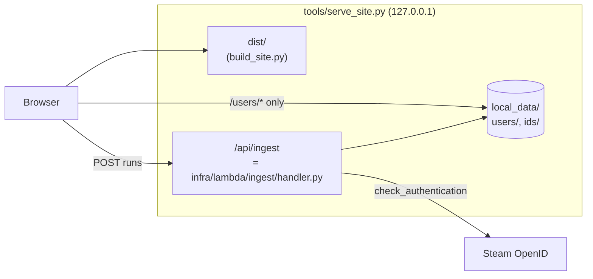

# slay-my-stats

Run-history stats for **Slay the Spire 2**, built from the `.run` files the game saves after every run.

It works two ways, from the same parser and the same dashboard code:

- **Locally:** `run.py` reads your history folder and writes one self-contained HTML file.
- **Online at [slay-my-stats.com](https://slay-my-stats.com):** you sign in with Steam and upload your history
  folder from the browser. Your profile lives at `/u/<name>`, named after your Steam name, and anyone can find
  it by searching on the home page.



The dashboard has five pages: Overview, Character Detail, Run Detail, Card Stats and Seed Data. They cover win
rates by character, ascension and build, boss and elite results, card and relic picks, per-floor HP and damage,
and seed lookup.

## Local use

Needs only Python 3.10+. No packages to install.

```sh
python run.py                           # finds your save folder, writes ~/sts2_viz.html, opens it
python run.py --history "<path>"        # a specific history folder
python run.py --out stats.html --no-open
```

The history folder is usually here:

| OS      | Path |
|---------|------|
| Windows | `%APPDATA%\SlayTheSpire2\steam\<SteamID64>\profile1\saves\history` |
| macOS   | `~/Library/Application Support/SlayTheSpire2/steam/<SteamID64>/profile1/saves/history` |



## The website

The site is static: an S3 bucket behind CloudFront. The only server-side code is one Lambda, which handles
uploads. For each player it stores one gzip'd JSON file, their Steam name and parsed runs, which the browser
downloads and renders.

### Player addresses

A profile's address is its Steam name reduced to lowercase `a-z0-9`: "Mr. Bean!" becomes `/u/mrbean`. The
address is set on the first upload and never changes. A later player with the same name gets `mrbean-2`, then
`mrbean-3`, and so on. A name with nothing usable left, such as one written entirely in Japanese, becomes
`player`, `player-2`, and so on. Renaming on Steam updates the name shown on the profile, not the address.

Steam IDs are never public. The data bucket holds:

| Key | Served | Contents |
|-----|--------|----------|
| `users/<slug>.json.gz` | yes | `{"v":1, "name", "runs"}` |
| `users/_index.json.gz` | yes | every player's slug, name, run count and last upload, for the home page's search |
| `users/_stats.json.gz` | yes | site-wide running totals for the home page (see below) |
| `ids/<steamid>.json.gz` | no (CloudFront only serves `users/*`) | `{"slug"}`, so an upload finds its profile |

The Lambda gets the name from Steam's `GetPlayerSummaries` API using the key in SSM, and falls back to the
public profile XML if the API call fails.



### What an upload does

1. **Sign in.** "Upload your runs" sends you to Steam's OpenID login. Steam redirects back to the site with
   signed `openid.*` parameters, which prove your Steam ID. There are no accounts, sessions or cookies: every
   upload carries that proof, and the Lambda re-checks it with Steam.
2. **Pick the folder.** The browser reads the `.run` files locally. It drops runs your profile already has
   (once this browser has seen your profile's address from an earlier upload; otherwise it sends them all and
   the Lambda skips them), gzips the rest as NDJSON (one run per line) and POSTs them.
3. **Ingest.** The Lambda (`infra/lambda/ingest/handler.py`) then:
   - verifies the sign-in: Steam confirms the signature, `return_to` is this site, the sign-in is under
     30 minutes old, and it isn't the one that made the last write;
   - enforces a 60-second cooldown between writes;
   - parses each run with the same `run.py` the local tool uses;
   - rejects any run containing a string outside `[A-Za-z0-9_.-]`, because profiles are rendered in other
     people's browsers;
   - dedupes by start time, then merges with a conditional S3 write, so two simultaneous uploads can't lose
     each other's runs;
   - looks up your current Steam name; on a first upload, it claims your address with a must-not-exist write,
     so two new players with the same name can't both get it;
   - updates the home page's player list;
   - adds the new runs, and only those, to the site-wide stats.

   It responds with your address, name and counts. The browser remembers the address for next time.

### Site-wide stats

The home page shows stats across every player's solo runs (no multiplayer or daily runs, matching the
dashboard's Solo filter): win rate overall, by character and by ascension; the cards and relics most often
in winning runs; the fights that end the most runs; and the fastest win and highest ascension won.

Every figure is a running total: `[runs, wins]` pairs, counts, minutes, and best-so-far records. The upload
Lambda tallies just the runs an upload added and adds that onto `users/_stats.json.gz` with a conditional
write. No one's history is ever reread, and a duplicate run is never counted twice. The file holds raw
counts for every card and relic, around 8 KB for 600 runs, so the page does the ranking and its thresholds
can change without recounting.

The update is best effort, like the player list. `tools/rebuild_stats.py` recounts everything from the
profiles: run it by hand after adding a new figure, removing a profile, or if an update was missed
(`--bucket slay-my-stats-data` for the live site).

**Cost guard:** every service involved stays inside the free tier at normal traffic. If any spend appears, a
$1 budget alarm triggers a small Lambda that throttles the ingest function to zero.

## Development

```sh
python -m venv infra/.venv
infra\.venv\Scripts\pip install -r infra/requirements.txt      # CDK (only needed for infra/deploy)

infra\.venv\Scripts\python.exe build_site.py                   # builds dist/
infra\.venv\Scripts\python.exe tools/build_user_blob.py        # your runs -> local_data/ (optional)
infra\.venv\Scripts\python.exe tools/serve_site.py --port 8123 # http://127.0.0.1:8123/
```

`tools/serve_site.py` emulates the CloudFront routing. It also serves `POST /api/ingest` by running the real
Lambda handler against `local_data/` (the same `users/` and `ids/` layout as the bucket), so the upload flow,
including a real Steam sign-in, works locally. Locally the Steam name comes from the public profile XML, unless
you set `STEAM_API_KEY`.



Ingest tests:

```sh
infra\.venv\Scripts\python.exe -m unittest discover infra/tests
```

These tests stub Steam and S3. They include a round trip of your real local history, if you have one, which
must match `run.py`'s output exactly.

### Deploying

`git config core.hooksPath githooks` (once per clone) makes every push of `main` run `tools/deploy.py`, which:

1. runs `cdk diff`, and if the stack changed, asks y/N before `cdk deploy`;
2. builds `dist/`, with the ingest Function URL read from the stack outputs;
3. uploads only the files that changed and invalidates just those paths in CloudFront.

To skip it for one push, use `SKIP_DEPLOY=1 git push`. The Steam Web API key is a SecureString in SSM
(`/slay-my-stats/steam-api-key`), created outside CDK.

## Repository layout

| Path | What |
|------|------|
| `run.py` | Run parser plus the local HTML generator. The Lambda imports it too. |
| `js/`, `dashboard.css` | Dashboard code and styles. They are inlined by `run.py`, and bundled to `app.js` for the site. |
| `site/` | Site-only scripts: `boot.js` (loads a profile, or the player search and site-wide stats on `/`), `players.css`, and `upload.js` / `upload.css` (sign-in and upload). |
| `build_site.py` | Builds `dist/`: `index.html`, `app.js`, `catalog.json` (game-data catalog) and `site-config.json`. |
| `infra/` | CDK app: buckets, CloudFront, DNS, the ingest Lambda and its tests, and the kill switch. |
| `tools/` | Dev server, deploy script, user-blob builder, stats rebuild, and the game-data pipeline (below). |
| `card_data.json`, `relic_data.json`, `potion_data.json` | Card, relic and potion metadata extracted from the game. |
| `card_final/`, `card_portraits/`, `relic_images/`, `potion_images/`, `node_icons/`, `ui_icons/` | Committed, downscaled game art, served as-is. |
| `data_provenance.json` | Which game build produced the data and art above. |

### Refreshing game data

After a game update, run `python tools/refresh_game_data.py`. It recovers the game's `.pck` with
[GDRE Tools](https://github.com/GDRETools/gdsdecomp/releases), then re-extracts card, relic and potion data
from the game DLL (via pythonnet). Next it re-bakes card art and chrome, and checks that everything came
from the same build. Its requirements are in `tools/requirements.txt`. `--check` verifies without changing
anything, and `--stale` reports whether the installed game is newer than the committed assets.
